<div align="center">

# Fable Forge

**A website design skill for coding agents. Your agent designs from the subject, tells the truth on the page, and shows you real screenshots before it calls the job done.**

[](LICENSE.txt)
[](#quick-start)
[](CHANGELOG.md)

</div>

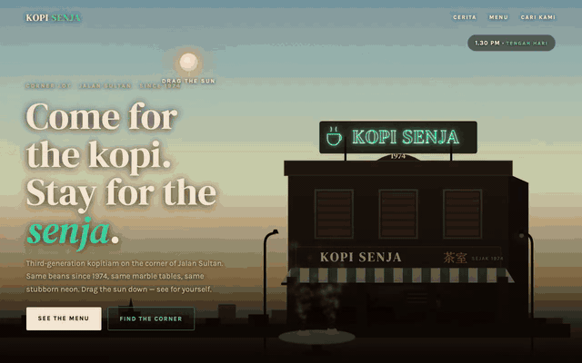

<sub>Kopi Senja, a concept study from Dainer's studio. The shop is a concept, not a real business, and any address shown is made up. Recorded in a real browser.</sub>

---

## Quick start

```bash
git clone https://github.com/Rebelzxr/fable-forge.git
cd fable-forge
./install.sh                      # Claude Code: ~/.claude/skills
```

Using Codex? Pass the folder: `./install.sh ~/.codex/skills`. Another agent that reads `SKILL.md` files? Pass its skills folder the same way. Already installed? Add `--force` to replace it.

Restart your agent, then try this on a project you have open:

> Use fable-forge. Redesign the landing page in this repo. Show me a direction note first, then build the first screen and check it at 390 and 1440 wide.

New to building with AI? Start with the beginner guides in the free [dainer.ai library](https://dainer-ai.vercel.app/library) and come back when you want a stricter design process.

## What it can do

- **Pick the right amount of work:** a bounded fix, a build from a direction you already approved, or a new direction pilot.
- **Write the page's job first:** who visits, what they need, the one main action, and the proof the page can honestly show.
- **Set a direction from the subject:** one memorable idea taken from the business itself, not from a template.
- **Build on your real stack:** your routes, components and tokens. No second demo app.
- **Catch the generic AI look:** a 30-item template-tells check that counts patterns with locations, without turning taste into a score.
- **Refuse fake proof:** no invented reviews, logos, user counts or prices on a real site. Concepts get labelled.
- **Prove it with screenshots:** phone, tablet and desktop renders plus the main interaction, before anyone says "done".

## Demo gallery

**Sites from Dainer's studio.** These are public pages from Dainer's own site and his concept collection. They show the kind of work this method is used for. This README does not claim any of them was built with this skill alone. Each image was captured with Playwright on 23 September 2026 at 1440 x 900 (desktop) and 390 x 844 (phone).

| Desktop | Phone |
|---|---|
| 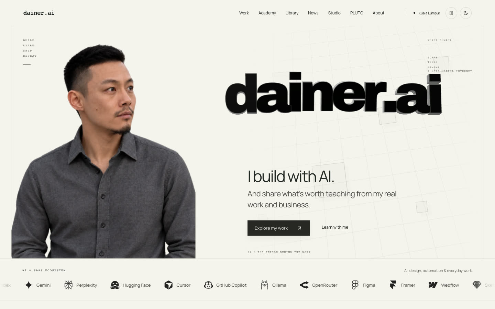 | 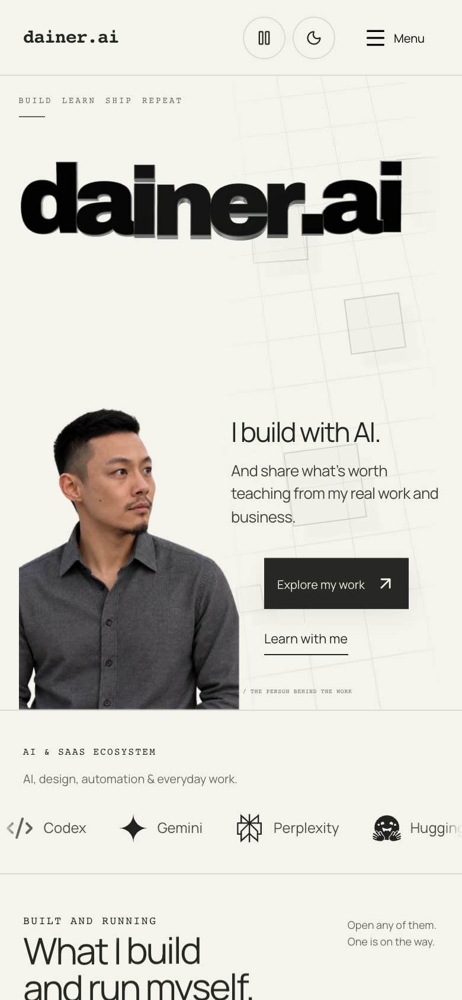 |

**[dainer.ai home](https://dainer-ai.vercel.app).** One big typographic idea, the wordmark, with the person and two clear actions.
On the phone the wordmark, photo and both buttons still fit the first screen.

| Desktop | Phone |
|---|---|
| 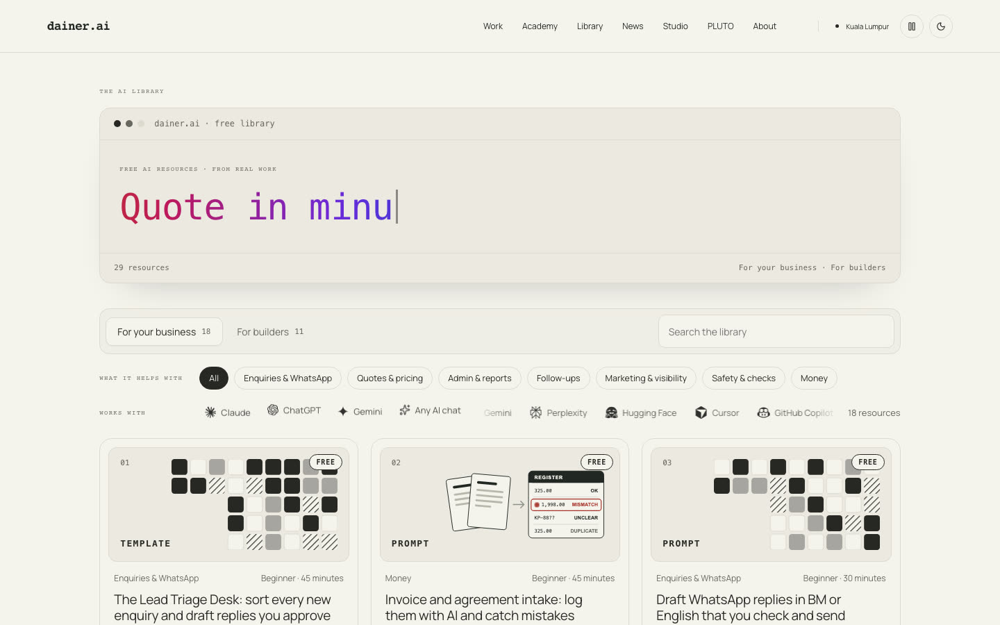 | 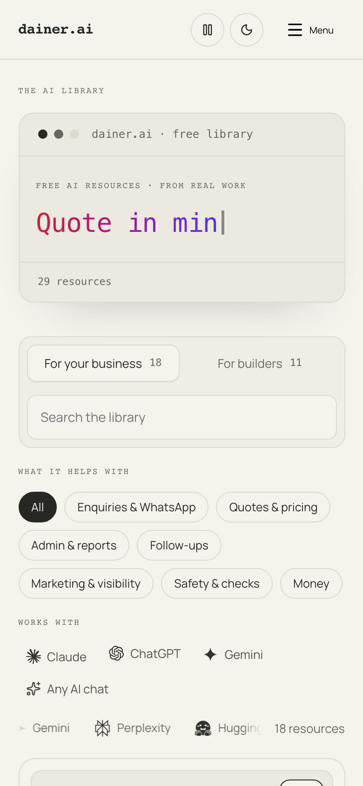 |

**[Free AI library](https://dainer-ai.vercel.app/library).** Filters and a search box over free resources, grouped by what they help with.
The headline types itself, so each capture catches a different line.

| Desktop | Phone |
|---|---|
| 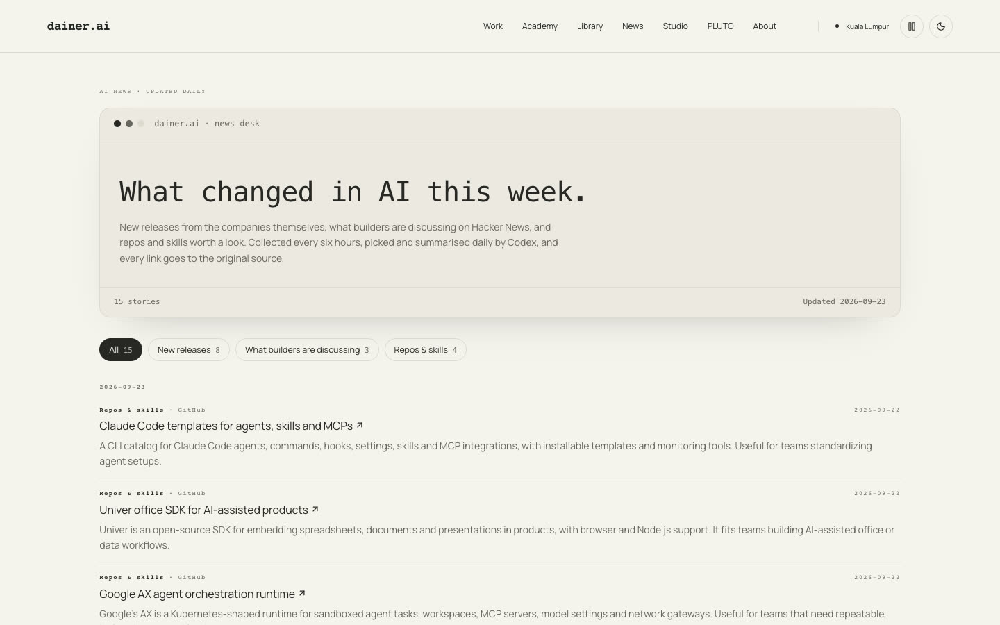 | 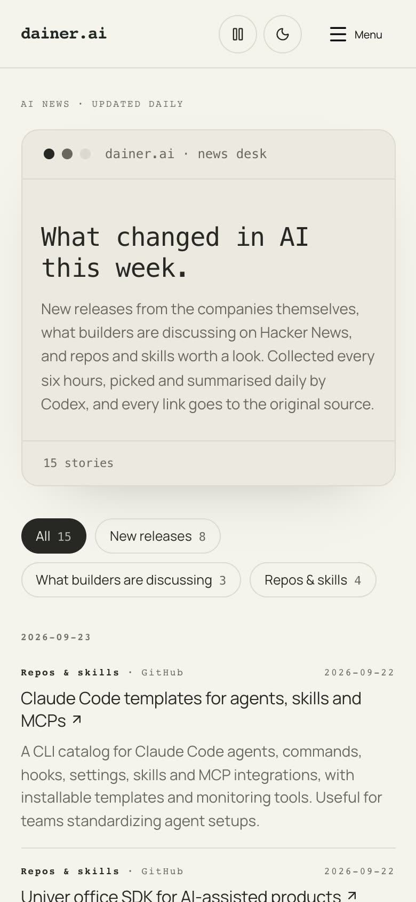 |

**[AI news](https://dainer-ai.vercel.app/news).** A reading page: dates, sources and one filter row, with nothing competing for attention.
The page states how the stories are collected and links every item to its source.

| Desktop | Phone |
|---|---|
| 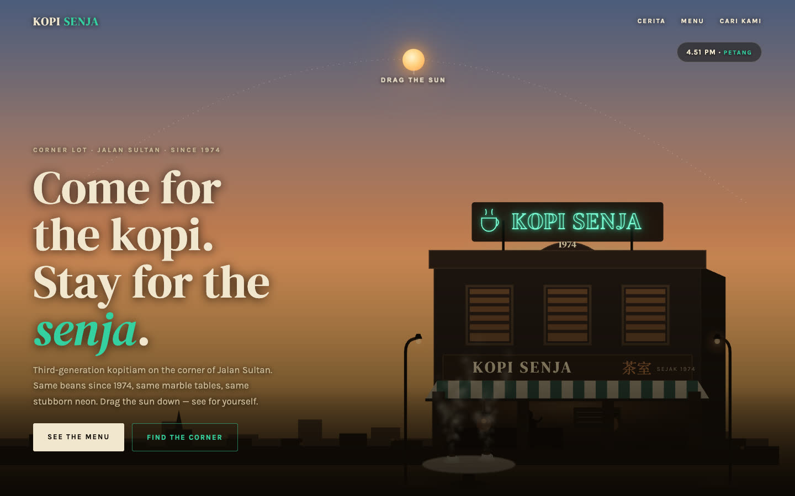 | 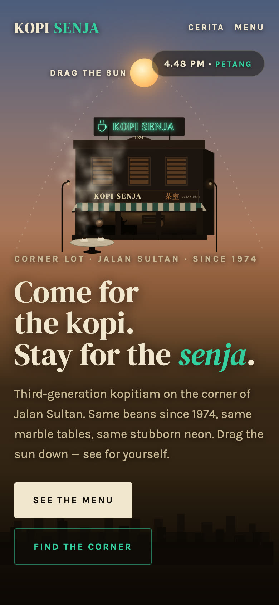 |

**[Kopi Senja](https://dainer-ai-showcase.vercel.app/sites/kopi-senja/)** (concept study, not a real shop). Drag the sun down and the kopitiam turns its neon on.
Worked through in [example 01](examples/01-kopi-senja.md).

| Desktop | Phone |
|---|---|
| 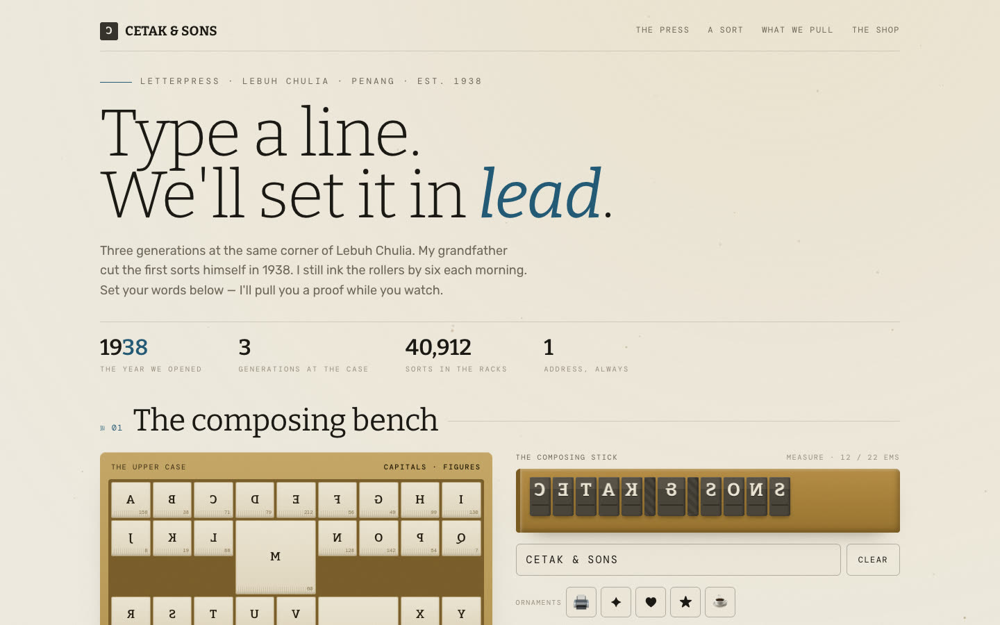 | 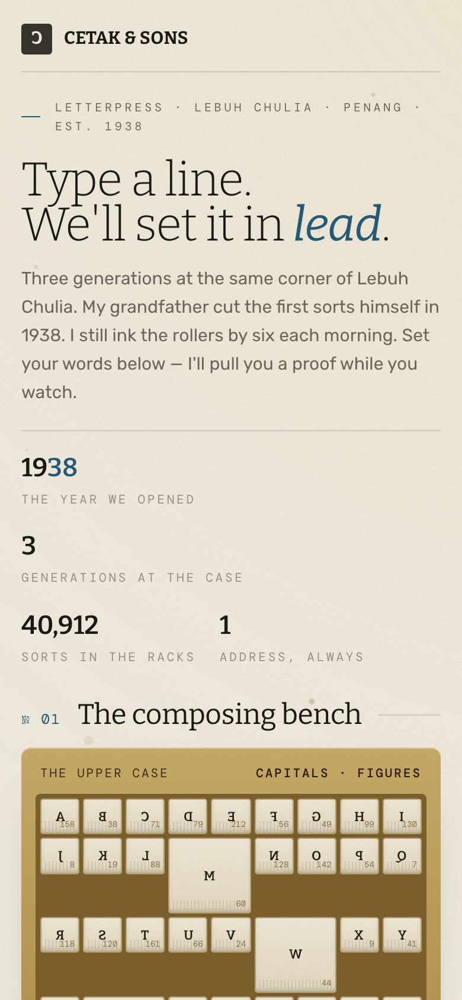 |

**[Cetak & Sons](https://dainer-ai-showcase.vercel.app/sites/cetak-press/)** (concept study, fictional shop). Type a line and it is set in lead in the composing stick.
Worked through in [example 02](examples/02-cetak-press.md).

| Desktop | Phone |
|---|---|
| 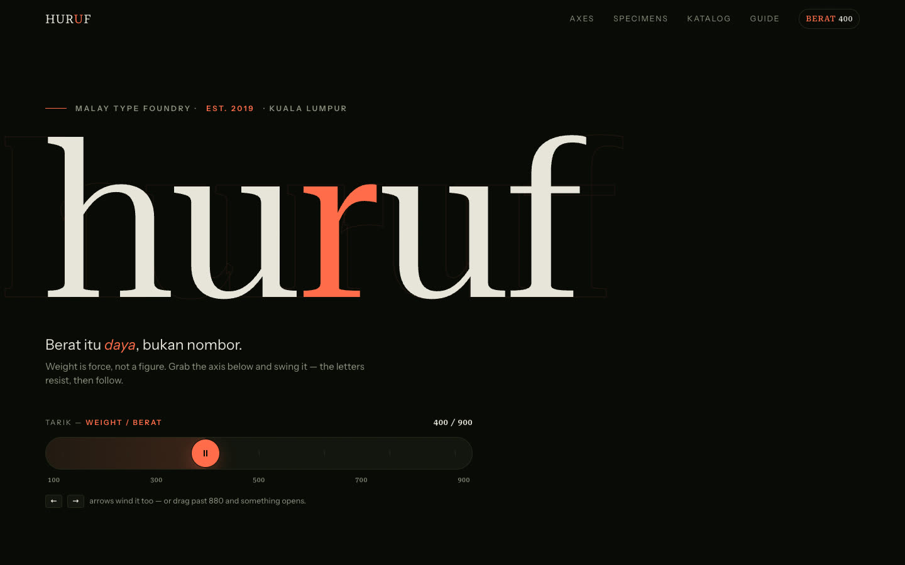 | 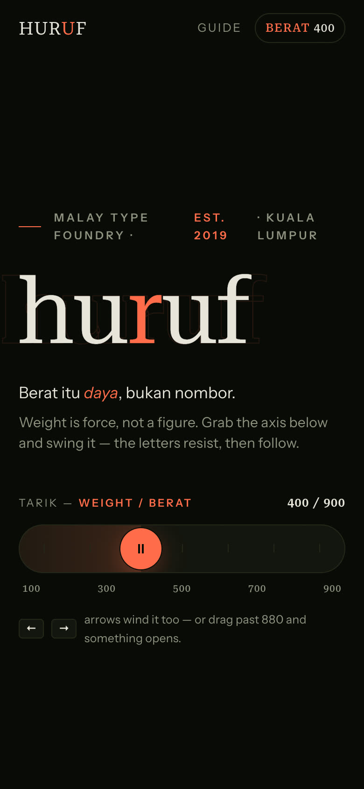 |

**[Huruf](https://dainer-ai-showcase.vercel.app/sites/huruf/)** (concept study, fictional foundry). A weight slider with mass; the letters resist, then follow.
Worked through in [example 03](examples/03-huruf.md).

| Desktop | Phone |
|---|---|
| 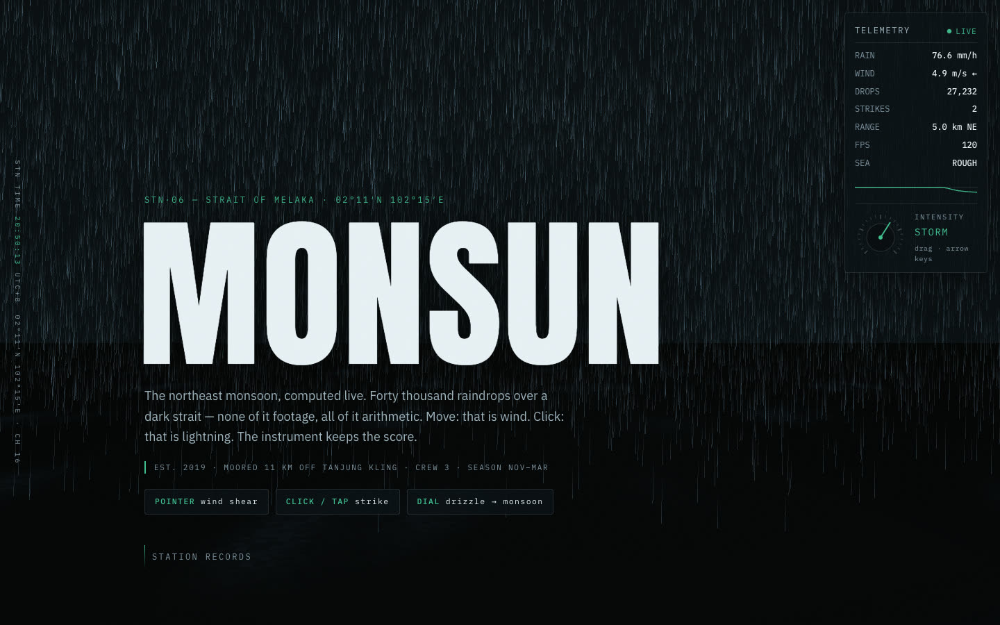 | 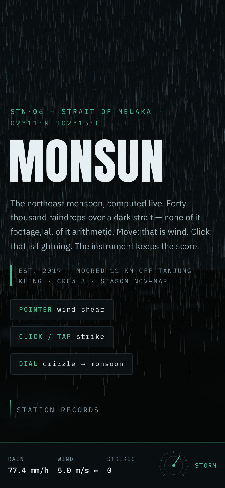 |

**[Monsun](https://dainer-ai-showcase.vercel.app/sites/monsun/)** (concept study, fictional observatory). A live rain field you steer with the pointer.
The text and controls stay in the page, so the storm is decoration, not a wall.

The full collection is at [dainer-ai-showcase.vercel.app/sites/](https://dainer-ai-showcase.vercel.app/sites/).

## Real use

Fable Forge is the design process Dainer uses for his own web work, including [dainer.ai](https://dainer-ai.vercel.app), the [free AI library](https://dainer-ai.vercel.app/library), the [AI news page](https://dainer-ai.vercel.app/news) and reviews of pages in his [studio collection](https://dainer-ai-showcase.vercel.app/sites/). Those pages went through several rounds and tools, so treat them as examples of the standard, not as output of this skill alone. The version in this repo is the same method with his private setup taken out. See [CHANGELOG.md](CHANGELOG.md) for exactly what changed.

## How it works

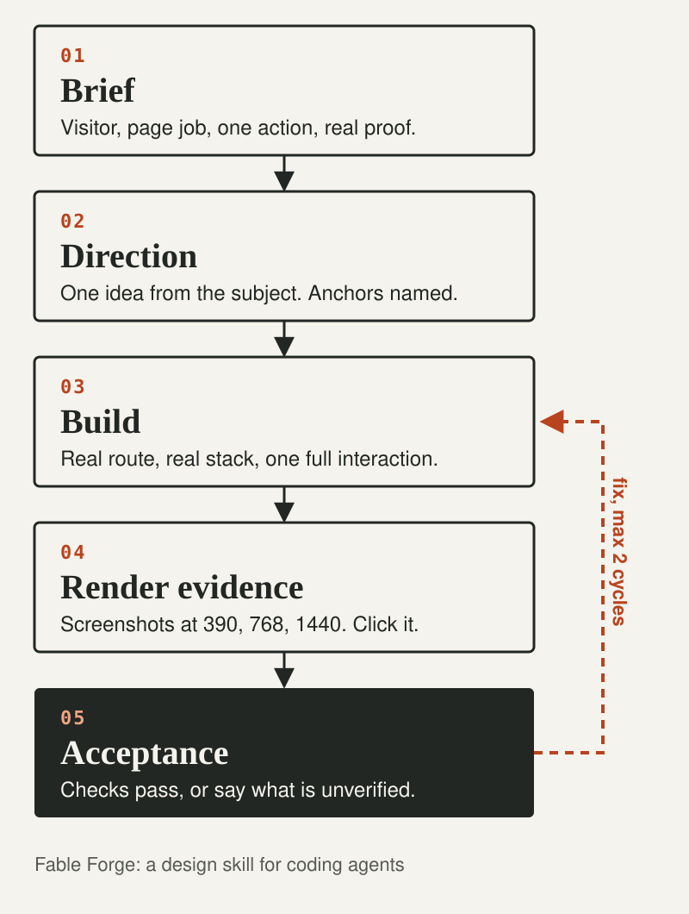

**1. Brief.** The agent reads the brief and the actual route, components and copy before it designs anything. It writes the page's job in a few lines: visitor, need, one primary action, honest proof.

**2. Direction.** A short note with one memorable idea from the subject, the visual anchors that must survive on every screen size, and what it is deliberately not doing. For a new direction, it builds one pilot and asks you before expanding.

**3. Build.** Changes go into your real app. Semantic HTML, working links and forms, visible focus, reduced motion. Motion only when it explains something, and never as the only way to reach content.

**4. Render evidence.** Real screenshots of the real route at 390, 768 and 1440 wide, plus the main interaction actually clicked. A unit test, an HTTP 200 or a self-score does not count as seeing the page.

**5. Acceptance.** Visual and functional checks are judged separately. The agent fixes what it saw, at most two focused repair cycles for the same defect, then reports what passed and what is still unverified.

The skill itself is small. Everything lives in [`skills/fable-forge/`](skills/fable-forge/):

| File | When the agent reads it |
|---|---|
| `SKILL.md` | Always. The method, work modes and report format. |
| `references/design-dna.md` | When choosing composition, type and materials. |
| `references/template-tells.md` | When checking whether a page looks generic or AI-made. |
| `references/reference-and-components.md` | When a reference site or component library is involved. |
| `references/motion.md` | Only when motion or interaction matters. |
| `references/acceptance.md` | Before calling the work done. |

## Safety and data flow

- **Reads:** your brief, the files in your project that relate to the page, and the rendered page in a browser if your agent has one.
- **Writes:** only the project files the task needs. `install.sh` writes one folder, `fable-forge`, into your skills directory.
- **Sends:** nothing. The skill is plain Markdown with no API key and no telemetry, and it makes no network calls itself. Its screenshot step uses Playwright, which may download a browser the first time you run it.
- **Never:** publishes, deploys, sends messages, spends money or changes accounts on its own authority. It does not invent reviews, client logos, user numbers or prices for a real business, and it treats reference sites as observations, not something to copy.

## Limitations

- It is a set of instructions, not a program. How well it works depends on your agent and model following them.
- Screenshots need a browser. If your agent has none, the skill will mark visual acceptance as unverified rather than guess. The `npx playwright` commands need Playwright's browsers installed.
- It cannot give an agent taste. It makes mismatches visible so you can judge them.
- The 30-item tells list is a review aid, not a validated score.
- The examples are reconstructions from public pages, not original build logs.

## Repo structure

```text
fable-forge/
├── README.md              this page
├── install.sh             copies the skill into your agent's skills folder
├── CHANGELOG.md           what changed for the public version
├── LICENSE.txt            Apache License 2.0
├── NOTICE                 attribution for the upstream frontend-design material
├── skills/
│   └── fable-forge/       the skill folder that gets installed
│       ├── SKILL.md       the method, work modes and report format
│       ├── references/    design, tells, components, motion, acceptance
│       ├── agents/        openai.yaml display settings for Codex
│       ├── LICENSE.txt    same licence, travels with the skill
│       └── NOTICE         same attribution, travels with the skill
├── examples/              three worked examples with acceptance evidence
└── assets/                gallery screenshots, scroll GIF, flow diagram
```

## Credits and licence

- Fable Forge adapts ideas from Anthropic's [frontend-design skill](https://github.com/anthropics/skills/tree/main/skills/frontend-design) in anthropics/skills (Apache-2.0). The same skill ships as the [Frontend Design plugin for Claude Code](https://github.com/anthropics/claude-code/tree/main/plugins/frontend-design), whose README lists its authors as **Prithvi Rajasekaran** and **Alexander Bricken**. That material was modified, condensed and combined with Dainer's own guidance. The original files are not reproduced here. See [NOTICE](NOTICE).
- This repo is released under the [Apache License 2.0](LICENSE.txt).
- Gallery images are screenshots of Dainer's own public sites.

## About

Made by **Dainer**, a systems builder in Kuala Lumpur who builds with AI and shares what is worth teaching from real work.

- Site: [dainer-ai.vercel.app](https://dainer-ai.vercel.app)
- Free AI library: [dainer-ai.vercel.app/library](https://dainer-ai.vercel.app/library)
- Run your agents with rules, receipts and safety checks: [Rebelzxr/ai-work-os](https://github.com/Rebelzxr/ai-work-os)

Found something confusing or broken? [Open an issue](https://github.com/Rebelzxr/fable-forge/issues) and say what you tried and what happened.
